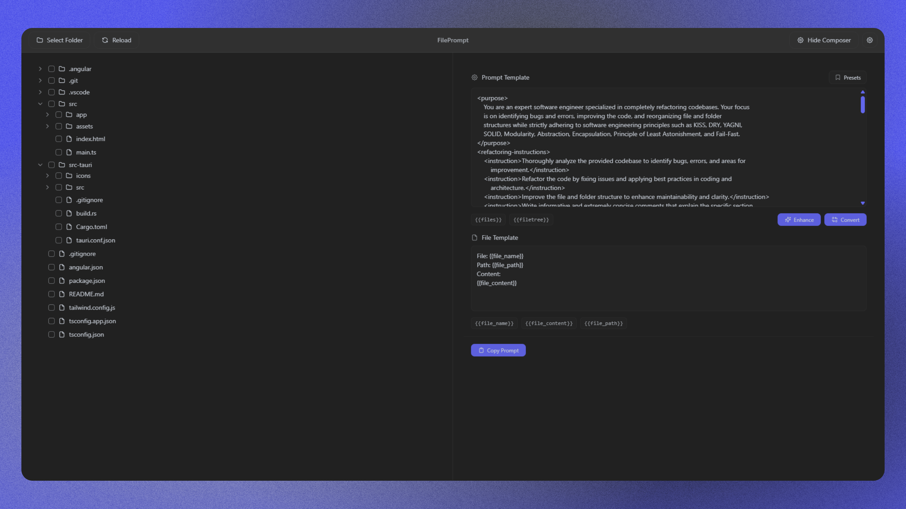

# FilePrompt



A modern desktop application that transforms your codebase into customizable prompts for LLM's through an intuitive file explorer and integrated prompt composer.

## Table of Contents

- [User Guide](#user-guide)
- [Developer Guide](#developer-guide)
- [Configuration](#configuration)
- [Features](#features)

## User Guide

**Overview:**  
FilePrompt lets you easily generate and enhance code prompts from your project files. By selecting a folder, exploring its file structure, and applying custom templates, you can quickly produce a well-formatted prompt ready to be copied to your clipboard.

**Common Workflows:**

- **Selecting a Folder:**

  - Click the **Select Folder** button in the header.
  - Use the native file dialog to choose a project folder.
  - The file tree view will load and display folders and files.

- **Navigating the File Tree:**

  - **Folders:** Click to expand/collapse and reveal nested files.
  - **Files:** Select files (only valid text files can be chosen) using the checkboxes. File metrics like size, line count, and token count are shown.

- **Generating a Prompt:**
  - Edit the prompt and file templates in the Prompt Composer. Use placeholders such as:
    - `{{file_name}}`
    - `{{file_path}}`
    - `{{file_content}}`
    - `{{files}}` (aggregated content) and optionally `{{filetree}}`
  - Click **Copy Prompt** to generate the prompt from selected files and automatically copy it to your clipboard.
- **Enhancing & Converting Prompts:**

  - Use the **Enhance** button to refine your prompt via an external API.
  - Use the **Convert** button to transform your prompt into different formats (e.g., Markdown or XML).

- **Additional Interactions:**
  - **Prompt Presets:** Save and load custom templates for future use.
  - **Toast Notifications:** Receive real-time feedback on actions (e.g., successful copy, errors).

## Developer Guide

**Project Structure:**

- **Frontend (Angular):**

  - `src/app/`  
    Contains Angular components such as:
    - **Header Component:** Navigation and action buttons.
    - **File Tree Component:** Recursive display of folder and file structures.
    - **Prompt Composer Component:** Interface for editing and generating prompts.
    - **Settings Modal & Toast Components:** For configuration and notifications.
  - `src/assets/`  
    Holds icons and styles (using Tailwind CSS).
  - `index.html`, `main.ts`  
    Entry points for bootstrapping the Angular application.
  - Configuration files: `angular.json`, `tsconfig.app.json`, and `tsconfig.json`.

- **Backend (Tauri/Rust):**
  - `src-tauri/`  
    Contains the Rust code that integrates with Tauri to provide native functionalities:
    - `main.rs`: Implements commands for folder selection, file reading, clipboard operations, and prompt generation.
  - Tauri configuration and build files: `tauri.conf.json`, `Cargo.toml`, and `build.rs`.

**Setup & Running the Application:**

1. **Prerequisites:**

   - **Node.js** and **npm** for managing Angular dependencies.
   - **Rust Toolchain** for building the Tauri backend.

2. **Installation:**

   - Clone the repository.
   - Run `npm install` to install frontend dependencies.
   - Run `npm run tailwind` (if not already running) to compile Tailwind CSS assets.

3. **Development:**

   - In a terminal, launch the Tauri application in development mode:
     ```bash
     npm run tauri dev
     ```

4. **Production Build:**
   - Package the Tauri application:
     ```bash
     npm run tauri build
     ```

**Contributing Guidelines:**

- Follow Angular and Rust best practices.
- Maintain consistency with established coding conventions.
- Write clear, concise documentation and comments.
- Ensure that changes are well-tested and documented.

## Configuration

**Application Settings:**

- **Prompt & File Templates:**

  - Customizable via the Prompt Composer.
  - Use placeholders such as `{{file_name}}`, `{{file_path}}`, `{{file_content}}`, and `{{files}}` to dynamically generate prompt content.
  - Templates are persisted in local storage for a personalized experience.

- **API & Model Settings:**
  - Access the **Settings Modal** from the header.
  - Enter your [OpenRouter API key](https://openrouter.ai/settings/keys) and select a model from the provided list.
  - These settings are required for the prompt enhancement and conversion features.

**Environment & Build Configurations:**

- **Angular:** Configured using `angular.json` and TypeScript configuration files.
- **Tauri:** Settings managed through `tauri.conf.json` and Rust’s `Cargo.toml`.
- **Tailwind CSS:** Configured in `tailwind.config.js`, with CSS built from `src/assets/styles/input.css`.

## Features

- **Intuitive File Explorer:**
  - Recursive display of folders and files with smooth animations.
  - Displays file metrics (size, line count, token count) for text files.
- **Dynamic Prompt Composer:**

  - Customize prompt and file templates with support for dynamic placeholders.
  - Enhance and convert prompts using integrated API calls.
  - Save and manage prompt presets for repeated use.

- **Native Desktop Integration:**

  - Uses Tauri for native file dialog, clipboard access, and optimized file system operations.
  - Built with Rust for performance and reliability.

- **Responsive & Modern UI:**
  - Styled using Tailwind CSS for a sleek, dark-themed interface.
  - Toast notifications and interactive modals enhance user experience.

Enjoy a seamless and efficient experience turning your codebase into actionable prompts for LLM's with FilePrompt!
